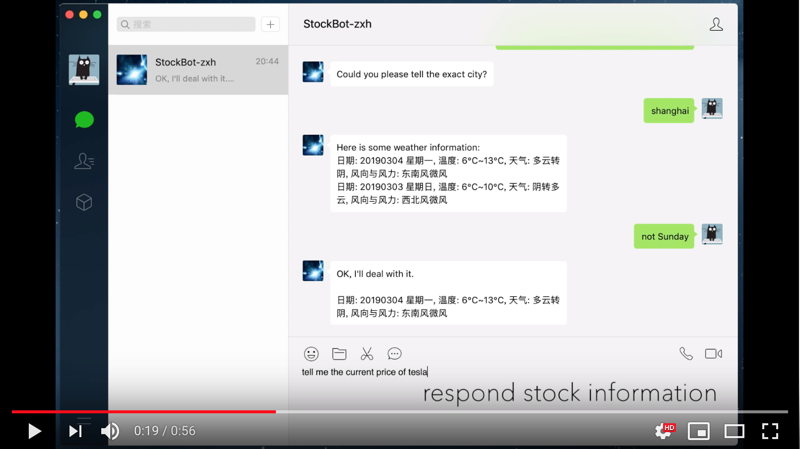

# StockBot

StockBot is a chatbot based on Rasa NLU aims to provide stock and weather information implemented by Python.


## Demo Video

[](https://www.youtube.com/watch?v=PnmfahdQ7PI)


If the video is unable to load, you can download it: [Demo.mp4](Demo.mp4)


## Environment

- Python 3.6.7

- Jupyter Notebook
- macOS


## Structure

```
├── StockBot                        
│   ├── StockBot.ipynb         // chatbot
│   ├── training_data.json     // training data for extracting intents and entities
│   ├── config_spacy.yml       // config for trainer
│   ├── city_code.db           // database(all provinces in China with their codes)
│   ├── Report.pdf             // report of this project
│   ├── Demo.mp4               // a demo showing an example dialogue
```


## Requirements

```python
pip install rasa_nlu
pip install iexfinance
pip install wxpy
pip install sqlite3
pip install matplotlib
```


## How to run

Just download and run it in jupyter notebook.


## Usage

### Rasa NLU

Documentation: https://rasa.com/docs/nlu/


Import:

```python
from rasa_nlu.training_data import load_data
from rasa_nlu.config import RasaNLUModelConfig
from rasa_nlu.model import Trainer
from rasa_nlu import config
```


#### Train

```python
trainer = Trainer(config.load("config_spacy.yml"))
training_data = load_data('training_data.json')
interpreter = trainer.train(training_data)
```


#### Extract intents and entities

```python
interpreter.parse("message")
```


### Iexfinance

Documentation: https://addisonlynch.github.io/iexfinance/devel/


Import:

```python
from iexfinance.stocks import Stock
from iexfinance.stocks import get_historical_data
from iexfinance.stocks import get_historical_intraday
```


Get data:

```
Stock(company).get_price() # get current price of a certain stock
Stock(company).get_key_stats()['ttmEPS'] # get TTM of a certain stock
Stock(company).get_news() # get relevant news of a certain stock
```


### Weather API

First you need to apply a key in: https://www.juhe.cn/docs/api/id/39 (Documentation can also be found here), and put it here:

```python
def get_weather(day_list, city):
    weather_key = ""
    
    # actions...
```


This API need you to post a request with the code of city or province which you want to query about. In order to try some database operations, this project establish a database consist of all provinces with their codes in China (`city_code.db`). 

```python
def get_citycode(city):
    conn = sqlite3.connect('city_code.db')
    c = conn.cursor()
    query = "SELECT * FROM city WHERE name = '" + city + "'"
    c.execute(query)
    result =  c.fetchall()
    
    code = '' 
    for row in result:
       code = row[0]
    return code
```


In fact this database is not necessary. If you don't want to do these database operations, you can try this API providing each province and city’s code: https://www.juhe.cn/docs/api/id/39.


### Connect to Wechat

#### wxpy

This part is based on the Python package: wxpy. Documentation: https://wxpy.readthedocs.io/zh/latest/bot.html.

```python
from wxpy import *

bot = Bot()
my_friend = bot.friends().search("name_of_your_friend")[0]

@bot.register(my_friend, TEXT)
def auto_reply(msg):
    
    # actions...

bot.registered
```

A QR code will be generated after creating a bot. Use your wechat account to scan this QR code and to login, then you can use your friend's wechat accout to chat with this chatbot.


#### itchat

Because the wxpy project have not updated for a long time, this project provide another way to connect to Wechat through a Python package called itchat. Documentation: https://itchat.readthedocs.io/zh/latest/

```python
import itchat
from itchat.content import *

itchat.auto_login()
my_friend = itchat.search_friends(name="name_of_yourfriend")[0]['UserName']

@itchat.msg_register([TEXT])
def auto_reply(msg):
    
    # action...

itchat.run()
```


### Debug in terminal

You can debug the code in terminal in following way instead of connect to wechat:

```python
while True:
    state = MAIN
    pending = None

    msg = input()
    print("USER: " + msg)

    state, pending, final_response, message_intent = send_message(state, pending, msg)
    print("BOT: " + final_response)
```


Have fun :)
